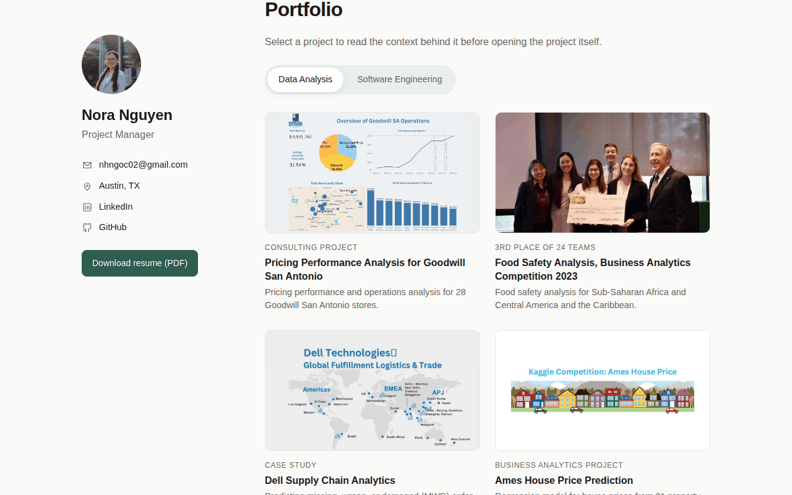
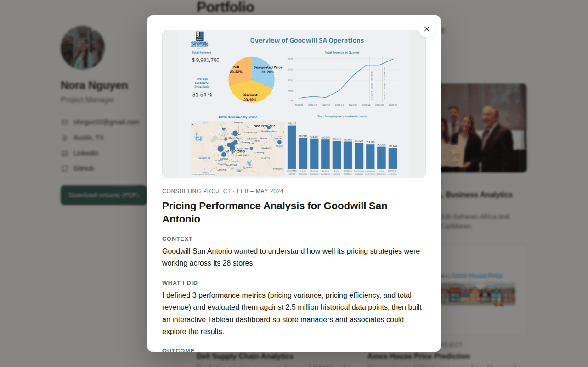

# Nora Nguyen · Personal Website

My personal website and portfolio: **https://nhngoc02.github.io/**

I'm a Project Manager at Applied Materials working on workflow automation, business intelligence, and supply-chain operations. This site collects my resume, my data analysis and software engineering projects, and some of the activities I've been part of.



## What's on the site

- **About**: who I am and what I work on
- **Resume**: experience, skills, and education, plus a one-page [PDF](./assets/Nora_Nguyen_Resume.pdf)
- **Portfolio**: all projects by default, with *Data Analysis* and *Software Engineering* tabs to filter them. Each project opens a short popup with the context, what I did, and the outcome before linking out to the project.
- **Activities**: competitions, conferences, and student organizations

<p>
  
  
</p>

## How it's built

A static site with plain HTML, CSS, and JavaScript, hosted on GitHub Pages. No build step.

```
index.html              page content (About, Resume, Portfolio, Activities)
assets/css/style.css    styles, including dark mode and mobile layout
assets/js/projects.js   portfolio project data
assets/js/script.js     tabs, portfolio filter, and project popup
assets/images/          photos and project thumbnails
```

### Adding a project

Add an entry to `assets/js/projects.js`. Set `category` to `"data"` or `"swe"` to choose the tab, and fill in the context, approach, outcome, tools, and links. Thumbnails look best at 16:9 and around 1200px wide.

### Running locally

```bash
python3 -m http.server 8000
# then open http://localhost:8000
```

## Contact

- LinkedIn: [linkedin.com/in/nhngoc02](https://www.linkedin.com/in/nhngoc02/)
- Email: [nhngoc02@gmail.com](mailto:nhngoc02@gmail.com)

---

The original layout was adapted from [vCard Personal Portfolio](https://github.com/codewithsadee/vcard-personal-portfolio) by codewithsadee.
